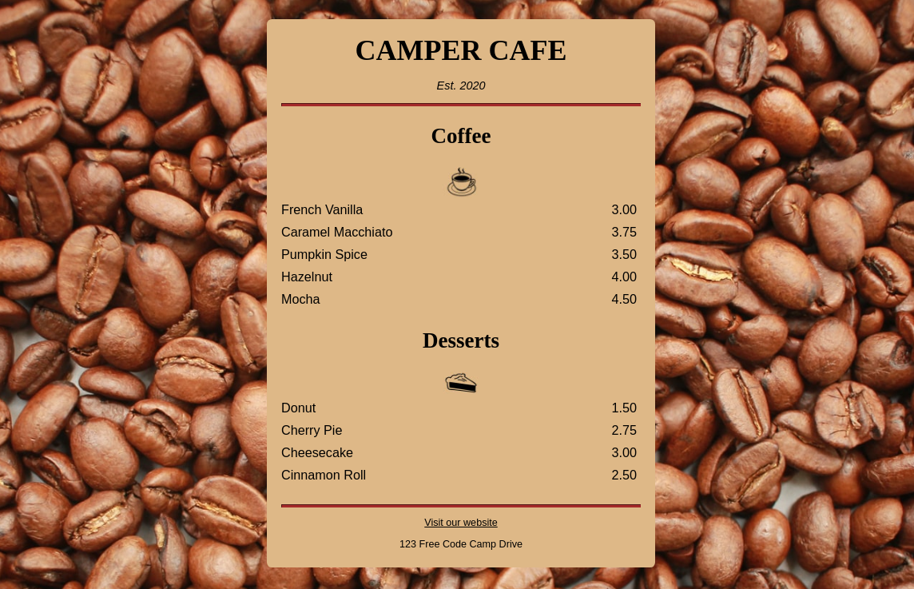

<h2 align="center">
  
   
  
  Camper Cafe ☕
  
</h2>

  
  
  

  

&nbsp;

  

  Copyright &copy; 2022-present
  <a href="https://github.com/NikolaM-Dev" target="_blank"><strong>Juan David Merchan Torres</strong>
  </a>

  

